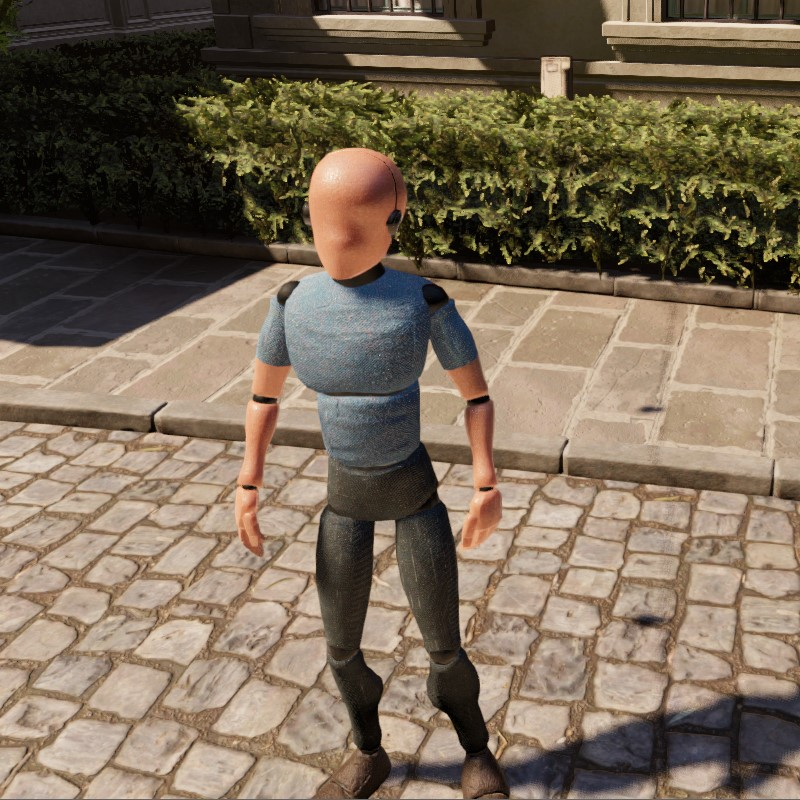

# Godot-Human-For-Scale

Simple third person controllable human that you can use to run around in your level to get a sense of scale. No input bindings or camera set up necessary, just drag and drop into your scene. The human is a 5'10 (177.8 cm) male.

## How to use
1. Clone or download the Github repository.
2. Move the repository folder (Godot-Human-For-Scale) to the root of your project.
3. Drag and drop the player scene (Human-For-Scale.tscn) into the scene you want to walk around in.
4. Run your scene.

**Make sure your scene has colliders for the floor at least, or the player will just fall through the map!**

## Controls
WASD to move  
SHIFT to sprint  
SPACE to jump  
V to noclip

ESCAPE to capture/uncapture mouse.

**Mouse is uncaptured on start!**
